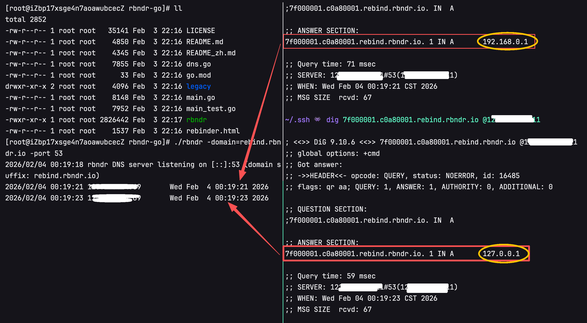

# rbndr
简易 DNS 重绑定服务

[English](README.md) | [简体中文](README_zh.md)

**本仓库为 [taviso/rbndr](https://github.com/taviso/rbndr) 的 Go 语言重构版本。**

rbndr 是一个极简的、非标准兼容的权威 DNS 服务，用于检测软件是否存在 DNS 重绑定漏洞。服务根据查询中的主机名，在其中的两个 IP 地址之间（按查询 ID 交替）选一个返回，并设置很短的 TTL。



## 构建与运行（Go）

```bash
go build -o rbndr .
./rbndr              # 监听 UDP 53（需 root）
./rbndr -port 5353   # 监听 5353，无需 root 即可测试
go test -v ./...     # 运行测试
```

### 自建与自定义域名

你可以在自己的服务器上部署 rbndr，并使用**任意域名后缀**（不限于 rbndr.us）。这对应社区在 [taviso/rbndr#10](https://github.com/taviso/rbndr/issues/10) 中的需求。

```bash
./rbndr -domain=rebind.example.com -port 53
```

之后主机名格式不变，只是后缀换成你的域名：

- `<ipv4-十六进制>.<ipv4-十六进制>.rebind.example.com`

例如：`7f000001.c0a80001.rebind.example.com` 会在 127.0.0.1 与 192.168.0.1 之间交替解析。子域长度不限（例如可用 `7f000001.c0a80001.rebind.mycompany.co.uk`，并设置 `-domain=rebind.mycompany.co.uk`）。

1. 将你的域名（或子域，如 `rebind.example.com`）的 NS 记录指向运行 rbndr 的服务器 IP。
2. 在该服务器上以 `-domain=rebind.example.com`（或你选的后缀）运行 rbndr。
3. 用 `host`、`dig` 或浏览器正常访问 `7f000001.c0a80001.rebind.example.com` 即可。

默认 `-domain` 为 `rbndr.us`，与公网服务兼容。

原始 C 实现位于 `legacy/rebinder.c`。

---

https://en.wikipedia.org/wiki/DNS_rebinding

DNS 重绑定是一种 TOCTOU（检查时与使用时不一致）类漏洞。若某服务用“预检”请求错误地放宽安全策略，就可能被利用。例如，假设有一个（虚构的）浏览器插件提供如下 API：

```
AllowUntrustedAccess("foobar.com");
SendArbitraryRequests("foobar.com");
```

而 `AllowUntrustedAccess()` 只是向目标主机发一个预检 HTTP 请求：

```
GET /CanIDisableSecurity HTTP/1.1
```

若该请求返回 200，插件就允许页面对该主机名进行完整访问。这可能是安全漏洞：你可以使用一个 rbndr 主机名，在“你控制的主机”和“你不控制的主机”之间切换。插件可能因此对任意 IP（如内网服务或 localhost）放行，即便该服务本身并未通过预检。

听起来不现实，但 Adobe Flash、Oracle Java 等过去正是这样工作的，不少产品至今仍存在类似逻辑。

Adobe 在 Flash 中尝试解决该问题的说明见：https://www.adobe.com/devnet/flashplayer/articles/fplayer9_security.html

对存在此类漏洞的软件，rbndr 提供了一种无需改 `/etc/hosts` 或自建完整 DNS 的测试方式。若软件只按*主机名*而非“主机名+IP”做绑定，攻击者就有可能获得对任意 IP 的访问权限。

主机名格式为：

```
<IPv4 十六进制>.<IPv4 十六进制>.rbndr.us
```

也可以用下列网站将点分十进制转为十六进制：

https://lock.cmpxchg8b.com/rebinder.html

例如，要在 `127.0.0.1` 和 `192.168.0.1` 之间切换，先转成十六进制再拼接：

```
7f000001.c0a80001.rbndr.us
```

测试示例：

```
$ host 7f000001.c0a80001.rbndr.us
7f000001.c0a80001.rbndr.us has address 192.168.0.1
$ host 7f000001.c0a80001.rbndr.us
7f000001.c0a80001.rbndr.us has address 192.168.0.1
$ host 7f000001.c0a80001.rbndr.us
7f000001.c0a80001.rbndr.us has address 192.168.0.1
$ host 7f000001.c0a80001.rbndr.us
7f000001.c0a80001.rbndr.us has address 127.0.0.1
$ host 7f000001.c0a80001.rbndr.us
7f000001.c0a80001.rbndr.us has address 127.0.0.1
$ host 7f000001.c0a80001.rbndr.us
7f000001.c0a80001.rbndr.us has address 192.168.0.1
...
```

可以看到，每次解析会得到两个地址中的一个。伪代码利用思路示例：

```
// 反复解析直到得到你控制的 IP，从而通过预检
while (AllowUntrustedAccesss("7f000001.c0a80001.rbndr.us") != true)
  ;

// 通过后等待 DNS 重绑定到目标
while (ConnectToPort("7f000001.c0a80001.rbndr.us", 123) != true)
 ;
 
// 此时已能访问 localhost:123，尽管 localhost 并未同意放宽安全策略
SomethingEvil();
```
